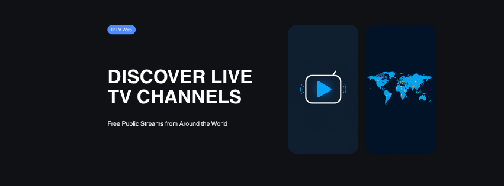

<p align="center">
  
</p>

# IPTV Web

Site que consome os dados **públicos** do projeto [iptv-org](https://github.com/iptv-org/iptv)
e os apresenta como uma plataforma de IPTV: catálogo de canais com logos, busca,
filtros (categoria, país, idioma) e player HLS no navegador.

## Funcionalidades

- 📺 **Catálogo** com logos, busca e filtros por categoria, país e idioma.
- ▶️ **Player HLS** (hls.js + fallback nativo no Safari) via proxy.
- ⭐ **Favoritos** e aba "Só favoritos" (salvos no navegador).
- 🕘 **Continuar assistindo** — reabre o último canal.
- 🗓️ **EPG "Agora/A seguir"** (best-effort, a partir das fontes XMLTV do `guides.json`).
- 🖼️ **Picture-in-Picture** e 🔗 **compartilhar canal** (link auto-contido).
- 📱 **PWA** — instalável, com cache do app shell para carregamento rápido/offline.
- 🌗 Tema claro/escuro e layout responsivo.

Veja [`RESOURCES.md`](RESOURCES.md) para o contexto curado (fontes de EPG,
datasets, bibliotecas) e próximos passos.

> Apenas canais **públicos e gratuitos** (licença CC0). Nenhum conteúdo é
> armazenado — o site apenas organiza e reproduz links já publicamente
> disponíveis. Não é, e não deve ser usado como, um serviço de retransmissão de
> canais protegidos por direitos autorais.

## Arquitetura

```
web/
├── server.js          Express: serve o front-end, /api/* e o proxy /stream
├── lib/
│   ├── data.js        Busca os JSON da API pública, normaliza e cacheia em memória
│   ├── proxy.js       Proxy de streams (CORS, mixed-content, headers, anti-SSRF)
│   └── epg.js         EPG "Agora/A seguir" (XMLTV, best-effort, com cache)
└── public/            Front-end estático (vanilla JS + hls.js) + PWA
    ├── index.html
    ├── manifest.webmanifest · sw.js · icon.svg
    ├── css/styles.css
    └── js/{app,ui,player,api,dom,store}.js
```

**Por que um back-end?** Um site puramente front-end falha na maioria dos
streams porque os servidores de origem normalmente não enviam cabeçalhos CORS,
muitos usam `http://` (mixed-content numa página `https://`) e alguns exigem
headers `Referer`/`User-Agent` que o navegador não consegue enviar via JS. O
back-end resolve os três pontos atuando como proxy.

## De onde vêm os dados

Por padrão, da API pública hospedada:

- `https://iptv-org.github.io/api/streams.json` (e `channels`, `categories`,
  `countries`, `languages`, `logos`, `feeds`).

Os dados **não são hardcoded**: são baixados e normalizados a cada inicialização
(e podem ser recarregados em tempo real via `POST /api/reload`). Se a lista do
repositório mudar, o site reflete na próxima carga.

Para apontar para outra origem (ex.: uma instância própria da API ou um mirror),
defina a variável de ambiente:

```sh
IPTV_API_BASE=https://sua-instancia/api npm start
```

## Como rodar

Pré-requisitos: **Node.js 18.11+** (o script `dev` usa `node --watch`; testado no Node 22).

```sh
cd web
npm install      # instala o express
npm run dev      # modo desenvolvimento (reinicia ao salvar)
# ou
npm start        # modo produção
```

Acesse **http://localhost:3000**.

Para mudar a porta: `PORT=8080 npm start`.

## Deploy (produção)

O `web/` já vem pronto para produção: `Dockerfile`, healthcheck em `/healthz`,
shutdown gracioso, headers de segurança, rate-limit no proxy e atualização
periódica do dataset. Variáveis de ambiente em [`.env.example`](.env.example).

> ⚠️ Precisa de um host com **runtime Node + saída de internet** (para baixar os
> dados do iptv-org). GitHub Pages **não serve** (é estático) — use Render, Fly.io,
> Railway, Cloud Run, etc.

### Docker (qualquer host)

```sh
cd web
docker build -t iptv-web .
docker run -p 3000:3000 iptv-web
```

### Render (1 clique, free tier)

1. Faça push deste repositório para o seu GitHub.
2. No [Render](https://render.com): **New → Blueprint** e selecione o repo. O
   `render.yaml` na **raiz** do repositório configura o serviço automaticamente
   (`rootDir: web`, build via `web/Dockerfile`).
3. Deploy. O healthcheck `/healthz` confirma quando estiver no ar.

### Fly.io

```sh
cd web
fly launch --no-deploy   # ajusta o nome do app no fly.toml
fly deploy
```

### Railway / Cloud Run

Apontam direto para o `Dockerfile`. Defina `PORT` conforme a plataforma
(o servidor respeita `PORT` e escuta em `0.0.0.0`).

### Variáveis de ambiente

| Variável | Padrão | Descrição |
| --- | --- | --- |
| `PORT` | `3000` | Porta (a plataforma costuma definir) |
| `HOST` | `0.0.0.0` | Interface de escuta |
| `IPTV_API_BASE` | API pública do iptv-org | Origem dos dados |
| `TRUST_PROXY` | `0` | Confiar no `X-Forwarded-*` (ative `1` atrás de proxy reverso) |
| `REFRESH_INTERVAL_MIN` | `360` | Atualização automática do dataset (min; `0` desliga) |
| `STREAM_RATE_MAX` | `600` | Limite de req/min por IP no `/stream` |
| `RELOAD_TOKEN` | — | Habilita `POST /api/reload` (header `x-reload-token`) |
| `XTREAM_USER` / `XTREAM_PASS` | — | Login fixo do Xtream; se vazios, aceita qualquer credencial (demo) |
| `XTREAM_DIRECT` | — | `1` faz o `/live` redirecionar à URL direta (sem passar pelo `/stream`) |
| `EPG_XMLTV_URL` | guia BR (epgshare01) | Fonte(s) XMLTV do EPG, separadas por vírgula |
| `CATALOG_FILE` | `data/catalog.json` | Catálogo próprio (Filmes/Séries) |
| `VOD_ENABLED` | `1` | Acervo de Filmes de domínio público (`0` desliga) |
| `VOD_IA_QUERY` / `VOD_MAX` | — | Consulta e teto do acervo do Internet Archive |

## API interna (back-end)

| Rota | Descrição |
| --- | --- |
| `GET /healthz` | Healthcheck — `200` quando os dados carregaram (`{status, streams, loadedAt}`) |
| `GET /api/meta` | Total + categorias, países e idiomas (com contagem) para os filtros |
| `GET /api/channels` | Lista filtrada/paginada. Query: `search`, `category`, `country`, `language`, `nsfw=1`, `page`, `limit` |
| `GET /api/epg` | Guia "Agora/A seguir" de um stream. Query: `stream=<channel@feed>`. Best-effort; `{ available: false }` quando não há guia |
| `POST /api/reload` | Recarrega os dados da API pública sem reiniciar o servidor. Protegido: exige `RELOAD_TOKEN` (env) e o header `x-reload-token`; sem o token definido o endpoint responde `403` |
| `GET /stream?url=…&ref=…&ua=…` | Proxy do stream (uso interno do player) |
| `GET /playlist.m3u` | **Playlist M3U para apps de TV** (IPTV Smarters, Smart IPTV, TiViMate…). Agrupada por contexto (Brasil por gênero; resto em "Internacionais"). Query: `country`, `category`, `language`, `search`, `nsfw=1`, `proxy=1` |
| `GET /player_api.php` | **Xtream Codes API** (auth + `get_live_categories` + `get_live_streams`). Login "host + usuário + senha" dos apps de TV |
| `GET /live/:user/:pass/:id` | Reprodução Xtream — redireciona o stream (via `/stream`; direto com `XTREAM_DIRECT=1`) |
| `GET /xmltv.php` | EPG XMLTV (programação real, focada nos canais brasileiros; cache 3 h + build em segundo plano) |

## Assistir na TV (apps de IPTV)

Os apps de IPTV de TV não abrem o site — eles carregam uma **lista M3U** por URL.
Use o endpoint `/playlist.m3u`:

```
https://SEU-DOMINIO/playlist.m3u?country=BR
```

- Sem filtro = todos os ~15 mil canais; recomenda-se filtrar (`country=BR`,
  `category=news`, etc.) para listas mais leves.
- Por padrão a lista usa as **URLs diretas** dos streams (melhor para apps
  nativos e poupa banda do servidor). Use `proxy=1` para roteá-las pelo `/stream`
  (resolve headers/HTTPS, mas consome banda do servidor).
- **IPTV Smarters Pro / TiViMate / OTT Navigator**: opção "Adicionar lista /
  Load M3U URL" → cole a URL acima.
- **Smart IPTV (siptv.app)**: cadastre a URL no painel do app pelo MAC da TV.

### Xtream Codes ("DNS + usuário + senha")

Muitos apps (IPTV Smarters, IBO, Duplex) pedem **servidor + usuário + senha** — é
o que o pessoal chama de "DNS". O back-end emula a Xtream Codes API:

- **Servidor/URL:** `https://SEU-DOMINIO` · **Usuário/Senha:** quaisquer valores
  não-vazios (modo demo). Para travar num login fixo, defina `XTREAM_USER` e
  `XTREAM_PASS` (env).
- No IPTV Smarters: **"Login with Xtream Codes API"** → preencha os três campos.

As categorias seguem o contexto: **Brasil por gênero** (Notícias, Esportes…) e
todo o resto em **Internacionais · {gênero}** (gêneros em PT-BR).

**EPG:** a API do iptv-org não fornece mais URLs de guia, então o `/xmltv.php`
consome uma **fonte XMLTV externa** (`EPG_XMLTV_URL`, padrão: guia público do
Brasil da epgshare01), casando com os canais BR por id/nome — com cache de 3 h e
build em segundo plano. A cobertura depende da fonte; aponte `EPG_XMLTV_URL`
para uma fonte com ids do iptv-org para casar 1:1.

Rotas: `GET /player_api.php` (auth + categorias + streams), `GET /live/:user/:pass/:id`
(redireciona para o stream; via `/stream` por padrão, ou direto com `XTREAM_DIRECT=1`),
`GET /xmltv.php` (EPG XMLTV).

### Filmes e Séries (VOD) — seu catálogo próprio

A Xtream também serve **Filmes** e **Séries**:

- **Catálogo próprio** (`data/catalog.json`): você define seus títulos (Filmes e
  Séries com temporadas/episódios). É **infraestrutura neutra** — use apenas
  conteúdo que você tem **direito de distribuir** (domínio público, produção
  própria ou licenciado). Schema documentado no topo de `lib/catalog.js`; veja o
  exemplo (curtas Creative Commons da Blender) em `data/catalog.json`.
- **Acervo de domínio público** (Internet Archive): adiciona automaticamente
  filmes livres ao VOD (desligue com `VOD_ENABLED=0`).
- Rotas de reprodução (redirect à origem; não hospedamos os GBs):
  `GET /movie/:user/:pass/:id` e `GET /series/:user/:pass/:episodeId`.
- Ações Xtream: `get_vod_categories`, `get_vod_streams`, `get_vod_info`,
  `get_series_categories`, `get_series`, `get_series_info`.

> **Conteúdo atual/protegido** (lançamentos) exige **licenciamento** — não é
> incluído nem raspado de fontes piratas. A responsabilidade pelo direito do
> conteúdo do catálogo é de quem opera o serviço.

## Segurança

- **Sem segredos no front-end.** O site não usa nenhum token. A origem dos dados
  é configurável por variável de ambiente, lida apenas no back-end.
- **Anti-XSS.** Todo dado da API entra no DOM via `textContent`/atributos — nunca
  `innerHTML` com dado cru (ver `public/js/dom.js`).
- **Validação de URL.** Logos e streams só são aceitos com protocolo `http`/`https`;
  esquemas como `javascript:` ou `data:` são rejeitados.
- **Proxy com allowlist + anti-SSRF.** O proxy só acessa hosts presentes no
  dataset (mais hosts referenciados por playlists já confiáveis, com teto de
  crescimento) e bloqueia destinos internos/privados/especiais: `localhost`,
  `127.0.0.0/8`, `10/8`, `192.168/16`, `172.16/12`, `169.254/16`, CGNAT
  `100.64/10`, TEST-NET, multicast/reservados, e **IPv6** (loopback `::1`,
  IPv4-mapeado `::ffff:…` (com e sem pontos), ULA, link-local `fe80::/10`) —
  inclusive quando o hostname chega entre colchetes ou com ponto final
  (`localhost.`). Cada salto de **redirect** é revalidado e o **DNS é resolvido**
  para barrar domínios que apontem a IP privado (mitiga *DNS rebinding*),
  impedindo SSRF via `Location` ou rebind.
- **Endpoint de reload protegido.** `POST /api/reload` exige `RELOAD_TOKEN`.
- **Timeout de rede.** As buscas à API pública têm timeout, evitando travamento.

## Limitações conhecidas

- Streams **geo-bloqueados**, offline ou que exijam DRM não tocam (esperado).
- Streams **MPEG-TS brutos** (não-HLS) podem não tocar em todos os navegadores.
- O EPG (programação) existe no projeto apenas como *fontes externas* de XMLTV;
  integrá-lo é um próximo passo natural (não incluído nesta versão).
